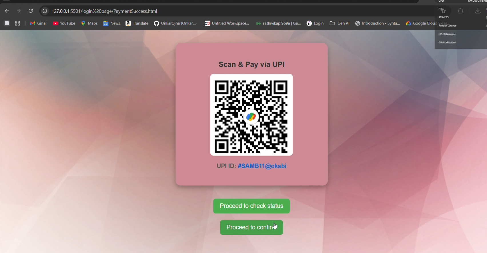
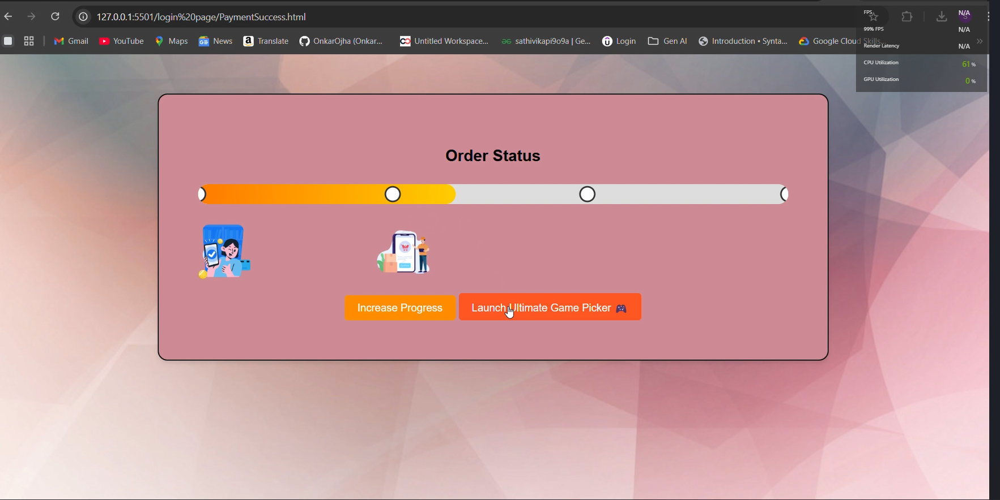
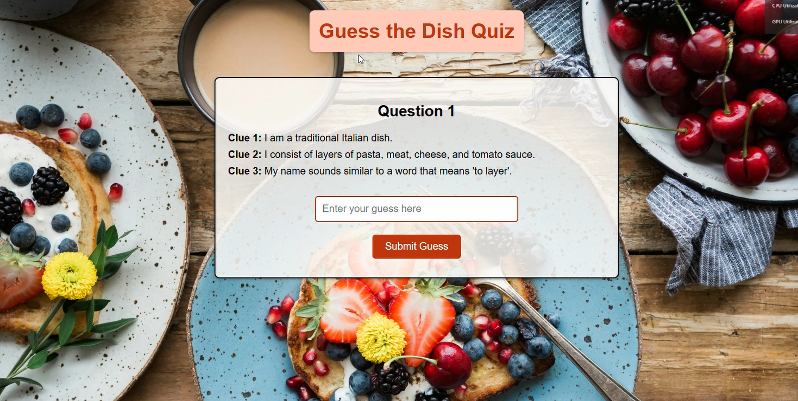
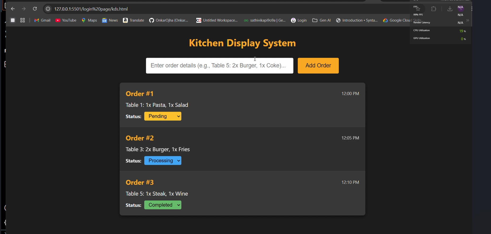

# SAMB's-Cafe-

## SAMB’s Café

SAMB’s Café is a smart café management system inspired by a Zepto-based problem statement.  
The project focuses on improving order flow, kitchen efficiency, and customer engagement using a technology-driven approach.

### Features
- Kitchen Display System (KDS) for real-time order tracking  
- Smart order and queue management  
- Gamification features to improve customer engagement  
- Optimized coordination between ordering and kitchen operations  

### Project Demo

🎥 Watch here: https://youtu.be/GTnq3ejCFDI

### Screenshots

  
  
   
    
     
      
       
        
         

